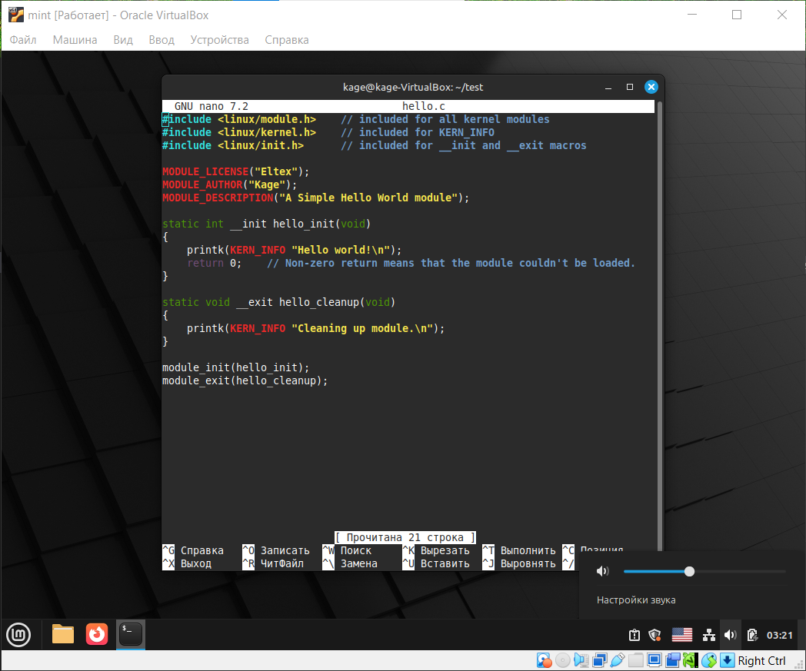
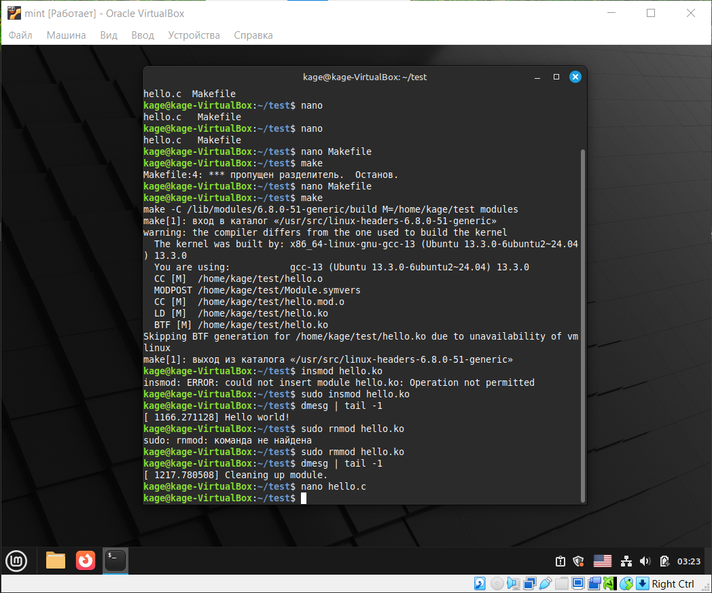

# Команда для пакетов
```bash
# apt-get install build-essential linux-headers-$(uname -r)
```

# hello.c



```C
#include <linux/module.h>    // included for all kernel modules
#include <linux/kernel.h>    // included for KERN_INFO
#include <linux/init.h>      // included for __init and __exit macros

MODULE_LICENSE("GLP");
MODULE_AUTHOR("Kage");
MODULE_DESCRIPTION("A Simple Hello World module");

static int __init hello_init(void)
{
    printk(KERN_INFO "Hello world!\n");
    return 0;    // Non-zero return means that the module couldn't be loaded.
}

static void __exit hello_cleanup(void)
{
    printk(KERN_INFO "Cleaning up module.\n");
}

module_init(hello_init);
module_exit(hello_cleanup);
```

# Makefile
```bash
obj-m += hello.o

all:
    make -C /lib/modules/$(shell uname -r)/build M=$(PWD) modules

clean:
    make -C /lib/modules/$(shell uname -r)/build M=$(PWD) clean
```

# Команда для проверки работы
```bash
# insmod hello.ko

# dmesg | tail -1
[ ] Hello world!

# rmmod hello.ko

# dmesg | tail -1
[] Cleaning up module.
```

# Компиляция


