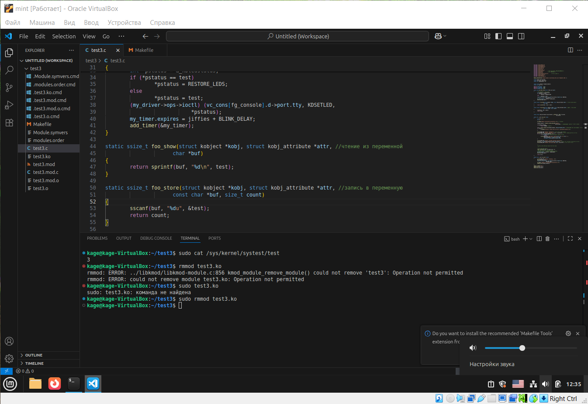

# Работа ПО



## Примечание

* У меня отсутствует клавиатура для проверки

# Код

<!-- #include "src/task3.c" -->

# Makefile
```bash
obj-m += task3.o

all:
    make -C /lib/modules/$(shell uname -r)/build M=$(PWD) modules

clean:
    make -C /lib/modules/$(shell uname -r)/build M=$(PWD) clean
```

# Команда для установки мода 
```bash
# insmod task3.ko

# rmmod task3.ko

```